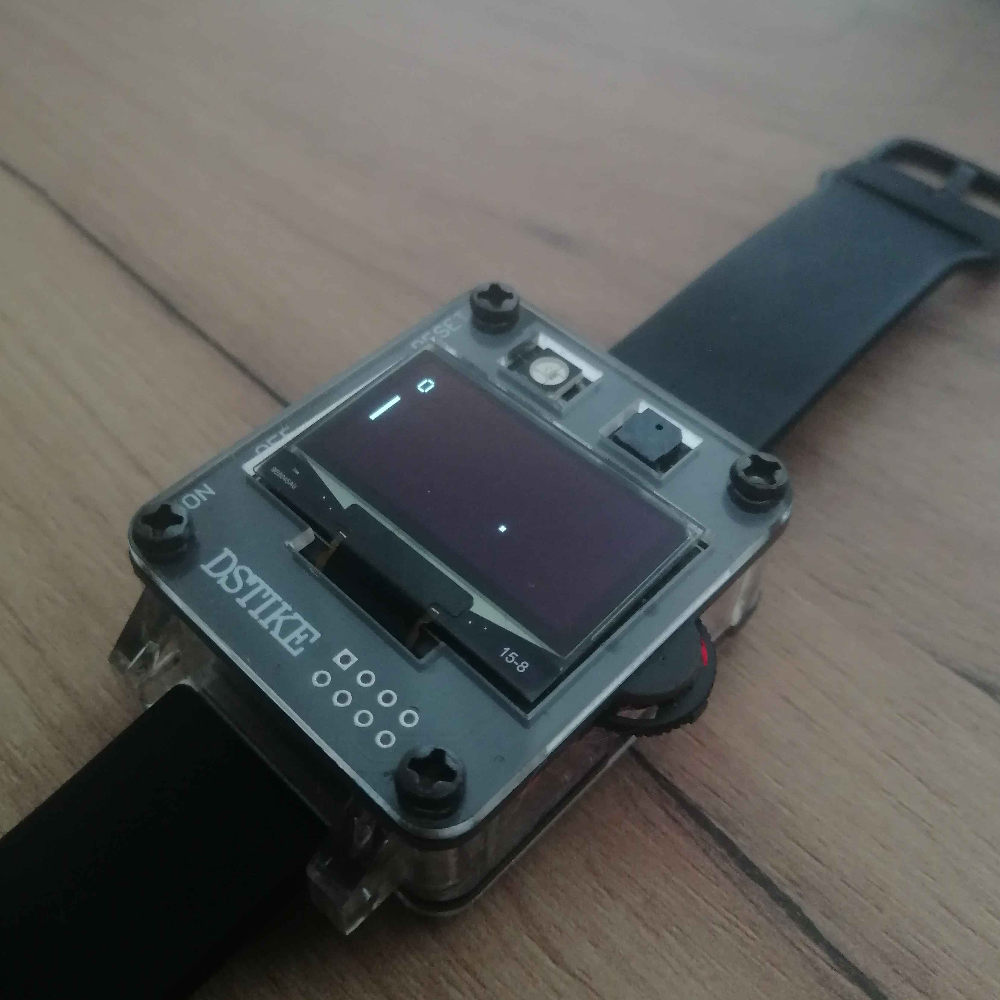

# DSTIKE-Pong

A port of singleplayer Pong for the ESP8266. Specifically developed to work on the DSTIKE Deauther watch.

### Building

This project can be built using PlatformIO.
Run the following to install the firmware on a board (in my case connected via USB):
```
sudo platformio run -t upload
```

### Screenshot



*literal screenshot lmfao*